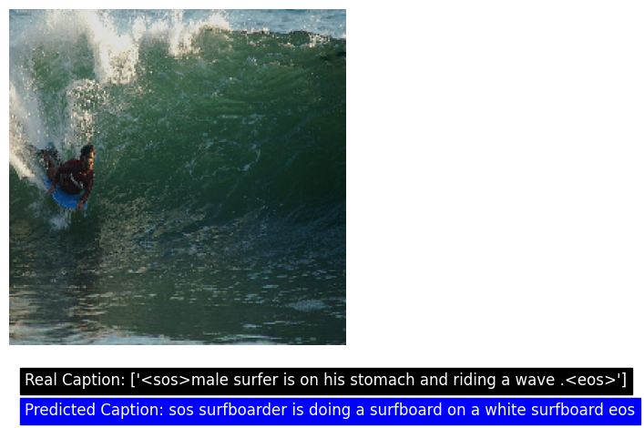

# Image Caption Generator  

This project is an **Image Caption Generator** that combines the power of convolutional neural networks (CNNs) and recurrent neural networks (RNNs) to generate captions for input images. By leveraging a **VGG16** feature extractor and an **LSTM-based decoder**, the model aims to understand visual inputs and generate textual descriptions.  

## How It Works 

1. **Feature Extraction**:  
   - The input image is passed through a pre-trained **VGG16** model (with the top layer) to extract deep image features.  
   - These features represent the visual context of the image.  

2. **Captioning Model**:  
   - A separate **LSTM model** is trained on caption data to learn the patterns and structure of language.  
   - The extracted image features are combined with the output of the LSTM to create context-aware representations.  

3. **Dense Layer**:  
   - The combined features from the image and LSTM are passed through a dense layer to generate a caption word by word.  

## Features ✨  

- **Image Understanding**: Uses **VGG16** to process images and extract meaningful features.  
- **Language Generation**: Combines visual features with sequential caption data to form meaningful captions.  
- **End-to-End Pipeline**: From image input to text output, the entire process is automated.  

## Limitations 🚧  

- **Incomplete Captions**: The model currently produces captions with only a few words rather than full sentences.  
- **Training Requirements**: Requires further training with diverse and large-scale datasets to improve accuracy and coherence.  
- **Performance**: Caption generation may sometimes be inconsistent depending on the image complexity.  

## Example Usage 🌟  

1. Input Image:  
     

2. Generated Caption:  
   **"sos surfboarder is doing a surfboard on a white surfboard eos"**  

   Real Caption:
   **male surfer is on his stomach and riding a wave **

## Setup 🖥️  

### Prerequisites  
- Python 3.x  
- TensorFlow/Keras  
- NumPy, OpenCV, and other libraries (listed in `requirements.txt`)  

### Installation  
1. Clone the repository:  
   ```bash
   git clone https://github.com/yourusername/image-caption-generator.git
   cd image-caption-generator

2. Install dependencies:
   ```bash 
   pip install -r requirements.txt

3. Download pre-trained weights (e.g., VGG16) if not included in the library by default.

## Training Details
1. Dataset: Trained using datasetof flickr 8k, which include images and corresponding captions.
2. Feature Extractor: Pre-trained VGG16 to extract image features.
3. Caption Model: LSTM-based decoder trained to predict the next word in a caption sequence

